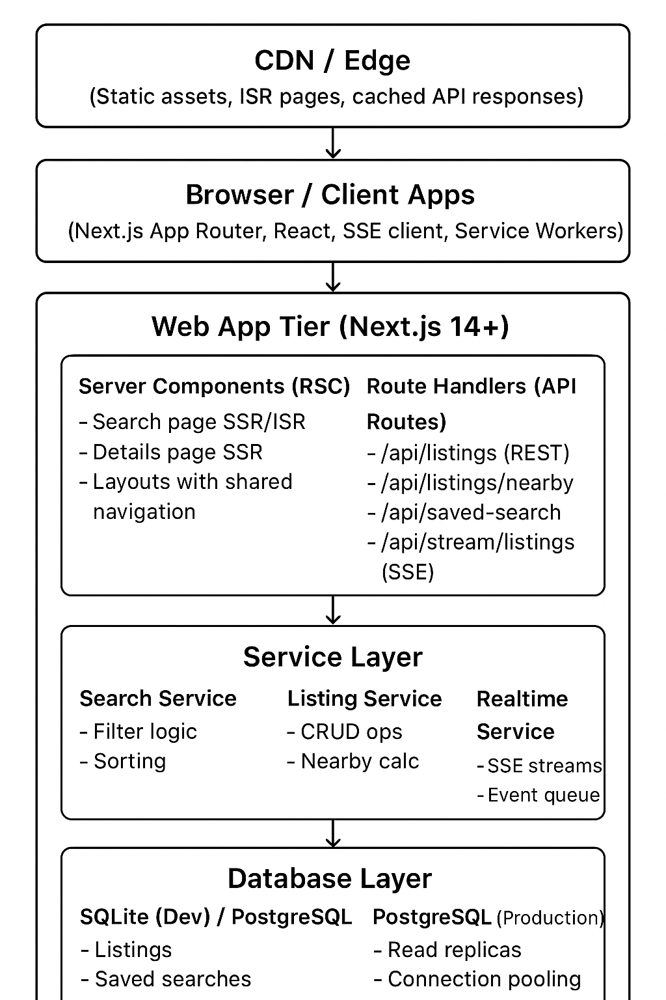

# Architecture Design Document

## Part A: System and Frontend Architecture Design

### A1. High-Level System Architecture

#### Component Overview



#### Component Responsibilities

**1. CDN / Edge Layer**
- **Responsibility**: Serve static assets (JS, CSS, images), cache ISR pages, and edge-cached API responses
- **Communication**: HTTP/HTTPS, synchronous
- **Scaling**: Horizontal via CDN providers (Vercel Edge, Cloudflare, AWS CloudFront). Cache invalidation via tags or TTL

**2. Browser / Client Apps**
- **Responsibility**: Render UI, manage client state, handle user interactions, maintain SSE connections
- **Communication**: HTTP/HTTPS for API calls, SSE for realtime updates, WebSocket (future) for bidirectional
- **Scaling**: Client-side, scales with user base. Service Workers for offline support and caching

**3. Web App Tier (Next.js)**
- **Responsibility**: 
  - Server Components: Render initial HTML, fetch data server-side, SEO optimization
  - Route Handlers: Process API requests, business logic, data validation
- **Communication**: 
  - Server Components: Direct DB queries via Drizzle/Prisma
  - Route Handlers: HTTP REST endpoints, SSE streams
- **Scaling**: 
  - Horizontal scaling via serverless functions (Vercel, AWS Lambda)
  - ISR for static generation with revalidation
  - Edge runtime for low-latency responses

**4. Service Layer**
- **Responsibility**: Encapsulate business logic, data transformations, coordinate between services
- **Communication**: Internal function calls (synchronous), future: message queues for async processing
- **Scaling**: Stateless services, scale horizontally. Consider caching layer (Redis) for frequently accessed data

**5. Database Layer**
- **Responsibility**: Persistent storage for listings, saved searches, user data
- **Communication**: SQL via ORM (Drizzle/Prisma), connection pooling
- **Scaling**: 
  - Read replicas for read-heavy workloads
  - Connection pooling (PgBouncer)
  - Partitioning by region (future multi-region expansion)
  - Consider search index (PostgreSQL full-text, Elasticsearch for advanced search)

**6. Realtime Updates Layer (SSE)**
- **Responsibility**: Stream new/updated listings to connected clients
- **Communication**: Server-Sent Events (SSE) over HTTP
- **Scaling**: 
  - Each Next.js instance maintains SSE connections
  - For high scale: dedicated SSE service or WebSocket gateway
  - Redis pub/sub to broadcast events across instances

#### Request Flow Examples

**Search Page Request:**
1. Browser requests `/` or `/search?q=downtown&min_price=1000000`
2. CDN checks cache (ISR page with matching params)
3. If cache miss, Next.js Server Component fetches from DB via Search Service
4. Server renders HTML with listings
5. Client hydrates, sets up SSE connection for realtime updates
6. User interactions (filter changes) update URL, trigger client-side refetch or navigation

**Realtime Update Flow:**
1. New listing created/updated in DB
2. Event emitted to Realtime Service
3. Service checks all active SSE connections
4. For each connection, check if listing matches user's filters or saved searches
5. Send SSE event to matching clients
6. Client receives event, updates UI (highlights new item, shows badge)

---

### A2. Frontend Application Architecture

#### Routing and Layouts

**Route Structure:**
```
/                          → Search page (SSR/ISR)
/listing/[id]              → Property details page (SSR)
/saved-search              → Saved search form (SSR with client form)
/saved-search/[id]         → Edit saved search (optional)
```

**Layout Hierarchy:**
```
app/
  layout.tsx               → Root layout (HTML, body, global styles)
    ├── Header             → Navigation, user identity, saved searches link
    └── [children]         → Page content
      ├── (search)/
      │   layout.tsx       → Search-specific layout (optional)
      │   └── page.tsx     → Search page
      └── listing/
          └── [id]/
              page.tsx     → Details page
```

**Layout Strategy:**
- Root layout provides shared navigation, footer, and global providers (theme, auth context)
- Nested layouts for route groups when needed
- Layouts are Server Components by default, can include client components for interactivity

#### State Management Strategy

**1. Search Filters**
- **Location**: URL query parameters (`?q=downtown&min_price=1000000`)
  - Server Component reads `searchParams` for initial render
  - Client component uses `useSearchParams()` and `useRouter()` for updates
  - Debounced updates to avoid excessive navigation

**2. Currently Selected Listing**
- **Location**: URL (`/listing/[id]`) or client state (when hovering in search)
- **Implementation**: 
  - `useState` in search page for hover state
  - URL navigation for persistent selection
  - Sync between list and map via shared state or event callbacks

**3. Saved Searches and User Sessions**
- **Location**: Server-side (database) + client cache (React Query/SWR)
- **Implementation**: 
  - Fetch on mount via Server Component or client hook
  - React Query for caching, refetching, optimistic updates
  - Context provider for user identity (guest vs authenticated)

**4. SSE/Realtime Stream Data**
- **Location**: Client-side state (React state or Zustand store)
- **Implementation**: 
  - Custom hook `useRealtimeListings()` manages SSE connection
  - Stores new listings in state, merges with existing list

**5. Form State (Saved Search Form)**
- **Location**: React Hook Form or controlled components
- **Implementation**: 
  - React Hook Form for validation and state management
  - Zod schema for validation
  - Optimistic updates before server confirmation

#### Component Design and Composition

**Component Hierarchy:**
```
SearchPage (Server Component)
  ├── SearchFilters (Client Component)
  │   ├── TextInput (reusable)
  │   ├── NumberInput (reusable)
  │   └── Select (reusable)
  ├── ListingsGrid (Client Component)
  │   └── ListingCard (Client Component)
  │       ├── PriceBadge
  │       ├── PropertyStats
  │       └── UpdatedTime
  └── MiniMap (Client Component)
      ├── MapCanvas/SVG
      └── Marker (multiple)
```

**Reusable Components:**
- `Button`, `Input`, `Select`, `Badge` → Design system primitives
- `LoadingSkeleton`, `EmptyState`, `ErrorBoundary` → UX utilities
- `Toast` → Notification system
- `Tooltip` → Hover information

**Responsiveness Strategy:**
- Mobile-first CSS with Tailwind breakpoints
- Conditional rendering: `md:flex-row` for desktop side-by-side, `flex-col` for mobile
- Map component: Collapsible on mobile, always visible on desktop
- Filters: Accordion on mobile, always expanded on desktop

**Accessibility:**
- Semantic HTML (`<nav>`, `<main>`, `<article>`, `<form>`)
- ARIA labels on interactive elements (map markers, buttons)
- Keyboard navigation: `tabIndex` on listing cards, Enter/Space to activate
- Focus management: Focus trap in modals, focus restoration on navigation
- Screen reader support: `aria-live` regions for dynamic updates (new listings)

**Theming/Design System:**
- Tailwind CSS for utility classes
- CSS variables for colors, spacing (enables theme switching)
- Component variants via `clsx` or `cva` (class-variance-authority)

---

### A3. Data Fetching, Caching and SEO Strategy

#### Data Fetching Strategy

**Server Components (RSC) for Initial Load:**
- **Search Page**: Server Component fetches listings via direct DB query
  - Benefits: SEO, fast initial paint, no loading spinner
  - Filters applied server-side via `searchParams`
- **Details Page**: Server Component fetches listing and nearby listings
  - Benefits: SEO, shareable URLs, fast load

**Client Hooks for Interactivity:**
- **Filter Updates**: `useRouter()` + `useSearchParams()` to update URL, trigger navigation
  - Next.js automatically refetches Server Component on navigation
  - Alternative: Client-side fetch with React Query for instant updates (no full page reload)
- **Saved Searches**: React Query/SWR for client-side caching and refetching
- **SSE Stream**: Custom hook manages EventSource connection

**Search Page Data Flow:**
1. Server Component reads `searchParams`
2. Calls Search Service with filters
3. Service queries DB with WHERE clauses
4. Returns paginated results
5. Server renders HTML
6. Client hydrates, sets up SSE for realtime updates

**Details Page Data Flow:**
1. Server Component reads `[id]` from params
2. Fetches listing by ID
3. Fetches nearby listings (Haversine distance)
4. Server renders HTML
5. Client hydrates, no additional data fetching needed

#### SEO and Performance

**SSR/SSG Choices:**
- **Search Page**: ISR with `revalidate = 60` (revalidate every 60 seconds)
  - Reason: Dynamic filters, but base page can be cached
  - Filtered results: Server-rendered on each request (too many combinations for static generation)
- **Details Page**: SSR (each listing is unique, needs fresh data)
  - Future: ISR with `revalidate` for popular listings

**Metadata Strategy:**
- **Search Page**: Dynamic metadata based on filters
  ```typescript
  export async function generateMetadata({ searchParams }) {
    const title = searchParams.q 
      ? `Properties in ${searchParams.q} - Property Search`
      : 'Property Search - Dubai Real Estate';
    return { title, description: '...' };
  }
  ```
- **Details Page**: Rich metadata per listing
  ```typescript
  export async function generateMetadata({ params }) {
    const listing = await getListing(params.id);
    return {
      title: `${listing.address} - ${formatPrice(listing.price)}`,
      description: `${listing.beds} bed, ${listing.baths} bath in ${listing.city}`,
      openGraph: { images: [...], ... }
    };
  }
  ```

**Caching Layers:**
1. **CDN/Edge**: ISR pages, static assets
2. **Next.js Segment Cache**: ISR pages, API route responses
3. **API Cache Headers**: `Cache-Control: public, max-age=30, s-maxage=60`
4. **Client Cache**: React Query/SWR for API responses, browser cache for static assets

---

### A4. Realtime Updates and Trade-offs

#### Realtime Channel Choice

**Comparison: SSE vs WebSockets vs Polling**

| Aspect | SSE | WebSockets | Polling |
|--------|-----|------------|---------|
| **Developer Experience** | Simple (EventSource API), native React hooks | More complex (connection management, reconnection logic) | Simplest (regular fetch) |
| **Browser Support** | Excellent (all modern browsers, IE11+ with polyfill) | Excellent (all modern browsers) | Universal |
| **Infrastructure Complexity** | Low (HTTP-based, works with standard load balancers) | Medium (requires WebSocket support in load balancer, connection state management) | Lowest (stateless HTTP) |
| **Scalability** | Good (HTTP/2 multiplexing, connection limits per server) | Good (bidirectional, but more stateful connections) | Poor (constant requests, high server load) |
| **Cost** | Low (standard HTTP infrastructure) | Medium (connection overhead) | High (bandwidth, CPU) |
| **Use Case Fit** | ✅ Perfect (one-way server→client updates) | Overkill (no bidirectional needed) | ❌ Poor (inefficient, high latency) |

**Choice: Server-Sent Events (SSE)**

**Justification:**
1. **One-way communication**: We only need server→client updates (new listings), not client→server messages
2. **Simplicity**: EventSource API is straightforward, easy to implement in React
3. **HTTP-based**: Works with standard infrastructure, no special WebSocket gateway needed
4. **Automatic reconnection**: EventSource handles reconnection automatically
5. **Good enough scale**: For 30-50k DAU, SSE can handle the load with proper connection pooling

**Future Considerations:**
- If we need bidirectional (e.g., user presence, chat), migrate to WebSockets
- For multi-region, use Redis pub/sub to broadcast events across regions
- Consider dedicated SSE service (e.g., Pusher, Ably) if scale exceeds single-instance capacity

#### Data Consistency and UX

**Realtime Updates + Cached Data:**
- **Strategy**: Merge new listings into existing list, don't replace entire list
- **Implementation**: 
  - Client maintains local state of listings
  - SSE events append/update items in state
  - React Query cache is updated optimistically
  - On next refetch, server data takes precedence (eventual consistency)

**Realtime Updates + Filters:**
- **Strategy**: Only show new listings if they match current filters
- **Implementation**: 
  - Client receives all new listings via SSE
  - Filter new listing against current `searchParams`
  - If match, inject into list with visual highlight
  - If no match, show badge "X new listings available" with option to view

**Realtime Updates + Saved Searches:**
- **Strategy**: Check new listings against all user's saved searches
- **Implementation**: 
  - Server-side: When emitting SSE event, include metadata about which saved searches match
  - Client-side: Show notification "New listing matches 'Downtown Apartments' search"
  - Optional: Email/push notification (future feature)

**Avoiding Confusing UI:**
1. **Append, don't re-sort**: New listings appear at top or bottom with "New" badge, don't automatically re-sort
2. **Visual distinction**: Fade-in animation, border highlight, badge
3. **User control**: "Show new listings" button, option to dismiss
4. **Debounced updates**: Batch multiple SSE events, update UI in single render
5. **Preserve scroll position**: Don't jump to top when new items arrive
6. **Loading states**: Show subtle indicator when processing new listings

**Example UX Flow:**
1. User has search page open with filters applied
2. New listing created that matches filters
3. SSE event received
4. Listing appears at top of list with fade-in and "New" badge
5. Small notification: "1 new listing found"
6. User can click to scroll to new listing
7. After 5 seconds, "New" badge fades out
8. Listing remains in list, sorted normally
